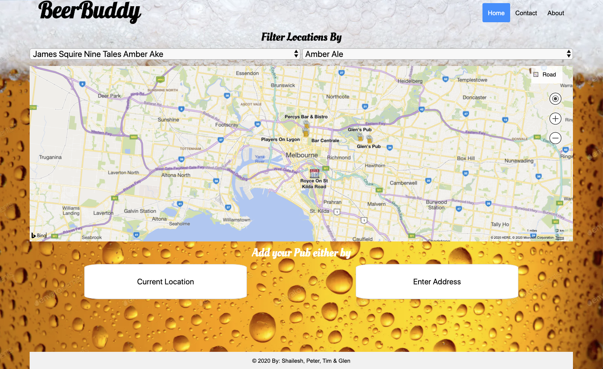

## Table of contents

-   [General info](#general-info)
-   [BeerBuddy Link](#BeerBuddy-link)
-   [Necessary Deliverables](#necessary-deliverable)
-   [To Do or Future Items](#to-do)
-   [Screenshots](#screenshots)
-   [In-depth Features of BeerBuddy](#in-depth-features-of-BeerBuddy)
-   [Challenges](#challenges)
-   [Technologies Used](#technologies-used)
-   [Approach Taken](#approach-taken)
-   [Download](#download)

## General info

This project is to demonstrate both client side and Server side technologies within in team environment to encapsulate the following:

-   Craft thoughtful user stories together, as a team
    making use of an API (your own endpoints or 3rd party when it make sense) somewhere in your project.
-   Manage team contributions and collaboration using a standard Git flow on Github.
-   Layout and style your front-end with clean & well-formatted CSS
-   Deploy your application online so it's publically accessible

## BeerBuddy Link

-   The link to the BeerBuddy online application is here:
    [https://fast-plains-49674.herokuapp.com/]
-   Public access to ER Diagram / Schema, Kanban, User Stories and Wireframe link:
    [https://whimsical.com/Ag1F3iFkPqXJFAgE5BS4hr]

## Necessary Deliverables

-   A link to your hosted working app in the URL section of your Github repo
-   A team git repository hosted on Github, with a link to your hosted project, and frequent commits from every team member dating back to the very beginning of the project
-   A readme.md file with:
-                     Explanations of the technologies used
-                     A few paragraphs about the general approach you took
-                     Link to your user stories – who are your users, what do they want, and why?
-                     Link to your wireframes – sketches of major views / interfaces in your application
-                     Link to your diagrams - database schema
-                     Descriptions of any unsolved problems or major hurdles your team had to overcome

## To-Do / Future Items

Future items include:

-   Allow the user to input their own beer type and beer brand.
-   Allow the user to create their own pub crawl based on their tastes and have the maps API draw the path and calculate the distance.

## Screenshots

## In-depth Features of BeerBuddy

-   BeerBuddy portal presents an easy to use map to see where Pubs can be pinned to map and can be rated for their beers.
-   A user can then easilty add a rating to their pub based on the their actual location or manually enter in the address.
-   Via drop down boxes, a user easily selects the beer type and brand before providing their rating.
-   The application then accepts the rating and updates the icons on the map to show which pubs have been rated or not.
-   A user can then utilise the drop boxes above the map to quickly search pubs that have their particular beer brand / type to see their ratings.

## Challenges

-   Node js with its "asynchronous" features. This was challenging when need to perform multiple queries on 1 route.
-   Locking down a realistic scope based on the approximate ~4 days timeframe took a bit of planning.
-   Understanding the use of static pages within express.
-   When code became too long on the monitor, it was challenging to ensure indentation was correct for bug finding.

## Approach Taken

-   Via pen and paper, wireframed a basic outline of key elements to be used and how positioned.
-   Via pen and paper, constructed simple ER diagram as part of it and converted it into a Whimsical Diagram and then established a basic Kanban board.
-   We identified the core features in the backlog and "stretch" features too if we had time.
-   Decided to perform pair programming where 2 people focused on Server / Database side functionality whilst the other 2 focused on the Client / map side of functionality.
-   Once the 2 components were working well in isolation, we then combined and ensured the routes and parameters were synchronised ensuring end-to-end functionality was working.
-   E2E testing occured to make sure the functionality and the look and feel were great with some minor updates to the CSS for polish.

## Technologies Used

Project is created with:

API:

1. Microsoft Bing Maps

Backend: Node.js
NPM Packages:

1. express
2. pg
3. pg-escape
4. body-parser
5. npm
6. ejs
7. axios
8. nodemon

Database: PostgreSQL

Frontend:

1. HTML
2. CSS
3. JavaScript

Deployment: Heroku

Version Control: Git

## Download

Download via:

-   https://github.com/mistergjones/beerbuddy.git
